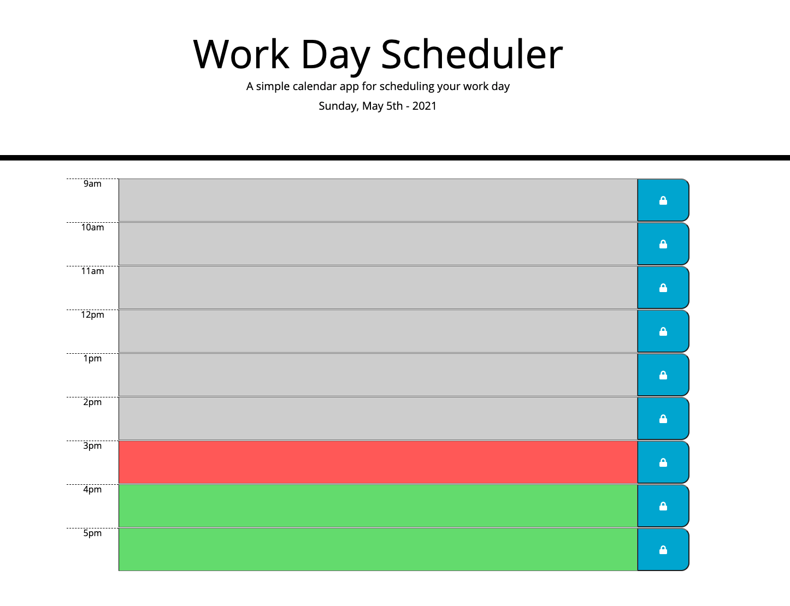

# 05 Third Party APIs
Assignment, Week 5; MSU Coding BootCamp

## Creating a Daily Planner

​

This is the fifth assigment for MSU Coding Bootcamp; to create a daily planner that logs daily events by the hour. It will use JQuery to create dynamic HTML and CSS, and will use Moment.js to work with date and time.

### Livepage Link
[Daniel Shoup's Daily Planner Page](https://danshoup.github.io/daily_planner/)

### Coding Quiz Screenshot

### Acceptance Criteria Summary

- Current day is displayed at the top of the calendar when opened.

- Timeblocks for hours are presented when scrolling.

- Timeblocks are color coded for the ghost of Christmas past, present, or future.

- Events can be entered when clicking on a timeblock.

- When clicking on the save button, event text is saved in local storage.

- Saved event data persists after page is reloaded. 

### Other Criteria

- Uses Moment.js or another date utility library to work with date and time.

- Quiz is deployed at live URL.

- Page loads with no errors.

- GitHub URL submitted.

- GitHub repository contains appropriate code.

- User experience is intuitive and easy to navigate.

- User interface is clean and polished.

- Applicateion resembles the mock-up and above criteria functionality.

- Repository has a unique name, and follows best practices for file structure and naming conventions.

- Quality README.md file with a description, screenshot, and link to deployed app.

- Repository includes manifold descriptive commit messages.

​

#### Dan's Notes:

JQuery and Moment.js are great tools and resources for creating more dynamic and useful content.  